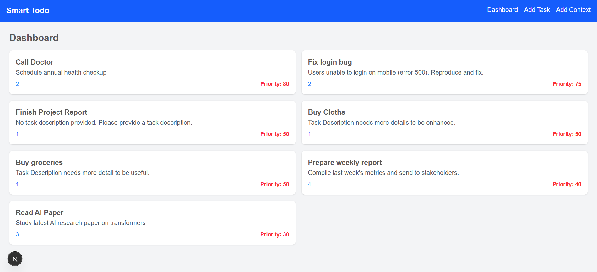
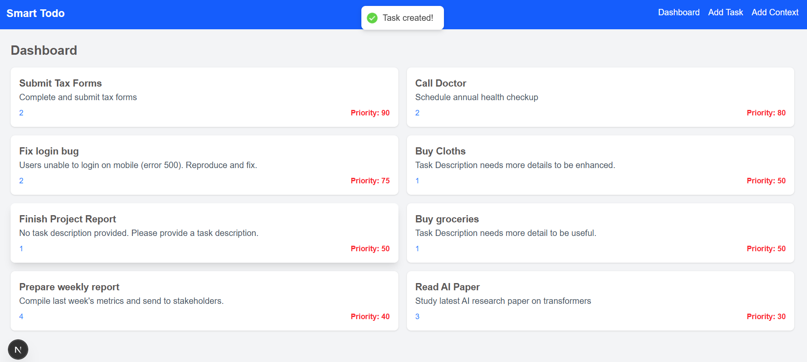
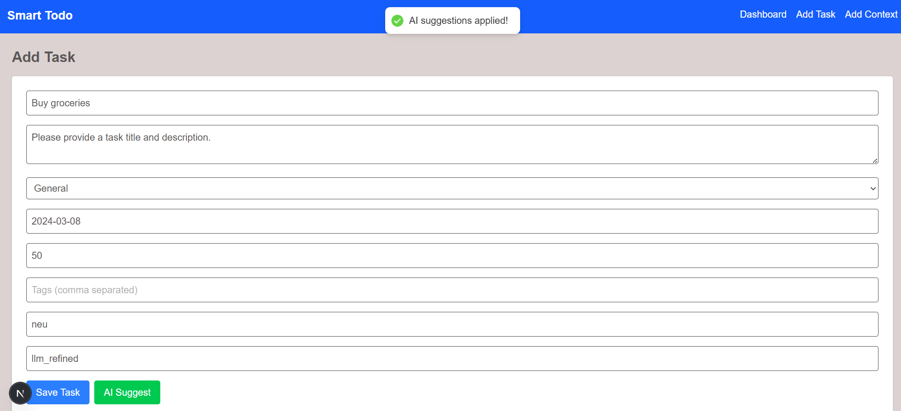
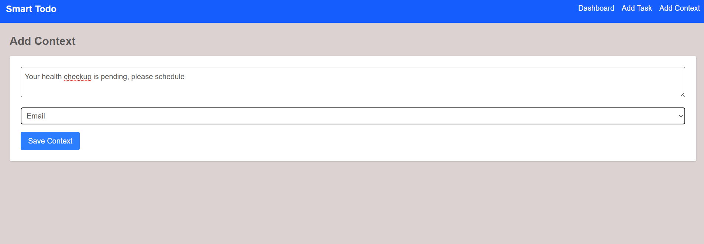
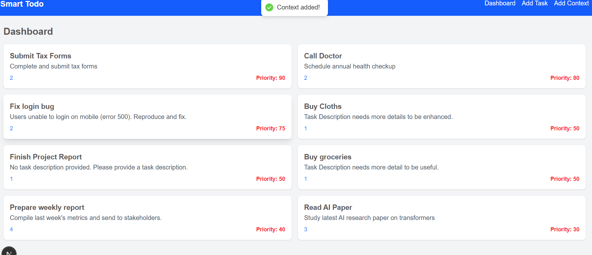

Project Name
Smart Todo List with AI

Description
This project is a full-stack web application that helps users manage tasks using AI-powered features. It provides intelligent task prioritization, deadline suggestions, context-aware recommendations, and smart categorization based on daily context such as messages, emails, and notes.

Backend

- Framework: Django REST Framework
- Language: Python
- Database: PostgreSQL
- APIs:
  GET
  - Retrieve all tasks
  - Get task categories and tags
  - Fetch daily context entries
    POSTreate new tasks
  - Add daily context data
  - Get AI-powered task suggestions

AI Features

- Context Processing: Analyze daily context to understand user's priorities
- Task Prioritization: Rank tasks based on urgency and context
- Deadline Suggestions: Recommend realistic deadlines
- Smart Categorization: Auto-suggest categories and tags
- Task Enhancement: Improve task descriptions with context-aware details
- Input Parameters: Task details, daily context, user preferences, current task load

Frontend

- Framework: NextJS
- Styling: Tailwind CSS
- Pages:
  - Dashboard: Display tasks, filter by categories, status, priority, quick add
  - Task Management: Create/edit tasks, AI suggestions, deadline recommendations
  - Context Input: Add daily context, view context history

Database

- Tasks Table: title, description, category, priority, deadline, status, timestamps
- Context Entries Table: content, source type, timestamps, insights
- Categories Table: category name, usage frequency

Setup Instructions

1. Install Python and NodeJS if not installed
2. Clone the repository
3. Navigate to the backend folder
4. Install backend dependencies using pip install -r requirements.txt
5. Set up PostgreSQL database and configure in settings
6. Run backend server using python manage.py runserver
7. Navigate to the frontend folder
8. Install frontend dependencies using npm install
9. Run frontend server using npm run dev

Usage

- Access the dashboard to view tasks
- Add daily context to improve AI suggestions
- Create new tasks and get AI-powered prioritization and deadlines
- Edit tasks with AI recommendations

Sample Data

- Include sample tasks and context entries for testing AI features

License
Specify the license if any

